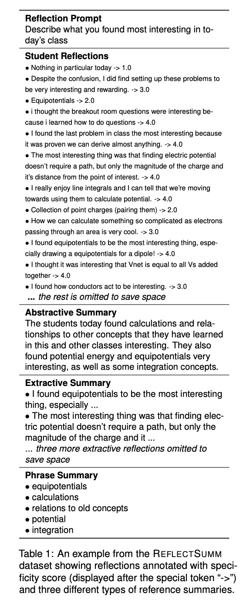

# REFLECTSUMM

 [**Dataset**](https://github.com/EngSalem/ReflectSUMM/tree/main/data) | [**Prompts**](https://github.com/EngSalem/ReflectSUMM/tree/main/prompts) | [**Model Outputs**](https://github.com/EngSalem/ReflectSUMM/tree/main/model_outputs)

This repository contains the code, data and model outputs for the LREC-COLING 2024 paper: 
REFLECTSUMM: A Benchmark for Course Reflection
Summarization


## Abstract

This paper introduces REFLECTSUMM, a novel summarization dataset specifically designed for summarizing students’ reflective writing. The goal of REFLECTSUMM is to facilitate developing and evaluating novel summariza- tion techniques tailored to real-world scenarios with little training data, with potential implications in the opinion summarization domain in general and the educational domain in particular. The dataset encompasses a diverse range of summarization tasks and includes comprehensive metadata, enabling the exploration of various research questions and supporting different applications. To showcase its utility, we conducted extensive evaluations using multiple state-of-the-art baselines. The results provide benchmarks for facilitating further research in this area.

## Citation
Please cite the following work if you are using our code / data
```
To be Updated
```

## ReflectSumm Dataset 

The ReflectSumm dataset can be found in the ``data`` folder as ``ReflectSumm.csv`` . 

*Meta-data* detailing each student's demographic information corresponding to their reflections is stored in the directory ``data/meta_data``.

<p align="center">
  
</p>

The followings are descriptions of column names
|Col. name | Description | Example|
|--|--|--|
|course|Course name + time ; Meaning: Course name with the offered semester| phys0175_1230-spring2021|
|number | The lecture name within the semester| 13|
|prompt| Reflection prompt on ''Describe what you found most **confusing**/**interesting** in today's class''|Describe what you found most interesting in today's class?|
|text_annotated_level*| the concatenation of reflection with annotated specificity (1-4) | All of the different ways to use Ohm's Law by rearranging the equation -> 3|
|text-predicted_level* | the concatenation of reflection with baseline predicted specificity (1-4)| All of the different ways to use Ohm's Law by rearranging the equation -> 4 |(see dataset)|
|reflections* | All student reflections, joint with "\n"|(see dataset)|
|unique reflections* | deduplicated reflections based on the reflections field | (see dataset) |
|abstractive summary | human generated abstractive summary | The students today enjoyed studying resistance and resistors, and also enjoyed the concept of Ohm's Law. Some students found circuits and analysis of them interesting, while other students found power interesting as well. Some students liked reviewing and relating concepts learned to real life.|
|extractive summary | A human-generated extractive summary, incorporating five student reflections connected with a unique delimiter  "\|\_\|" | Reflection 1 \|\_\| Reflection 2 \|\_\| Reflection 3 \|\_\| Reflection 4 \|\_\| Reflection 5|
| phrase summary | 5 phrases extracted by the annotator to best represent the cluster | Ohm's Law<br>Resistors/Resistance<br>Circuits<br>Power<br>Real world applications|
|phrase summ with support| same to phrases, but annotated with a supporting number of reflections and text spans extracted from the reflections. | {'Light Bulb/Demonstrations': {'support': 6, 'cluster_phrases': [spans in the original reflections]}} |

**Note**: In fields marked with *, multiple reflections are joined by a delimiter "\n". 

## Model Results and Prompts
###  Model Results
All model results for different tasks are available under the [model_outputs](https://github.com/EngSalem/ReflectSUMM/tree/main/model_outputs) folder. Please refer to the README.md for each task.

### LLM Prompts
We include all LLM prompts under [prompts](https://github.com/EngSalem/ReflectSUMM/tree/main/prompts).

